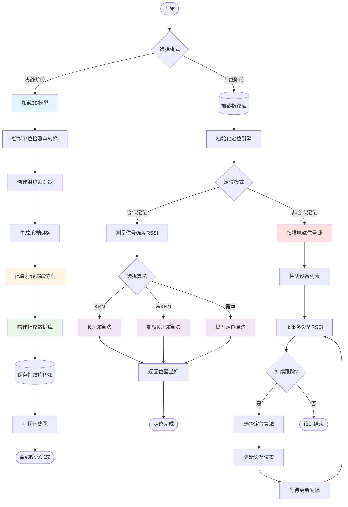
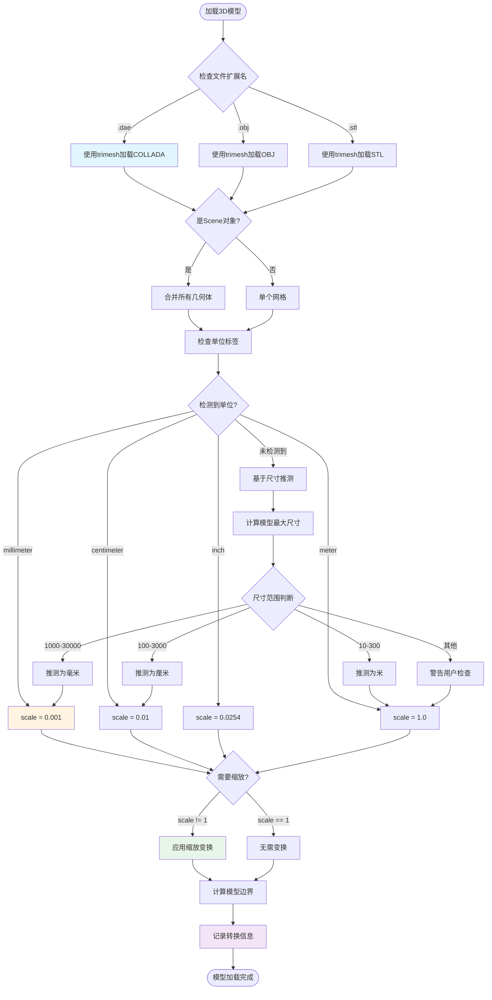
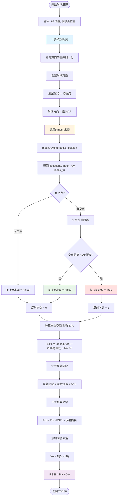
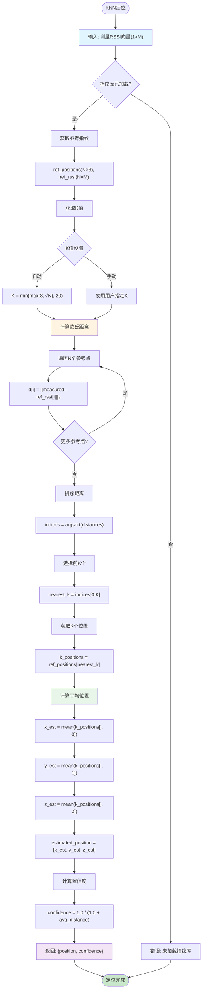
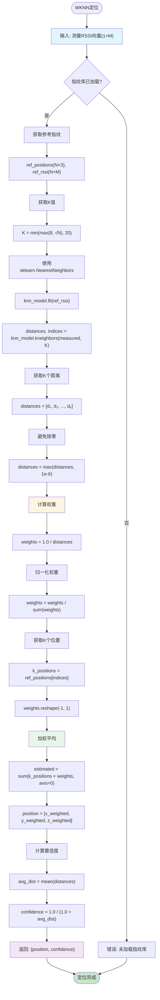
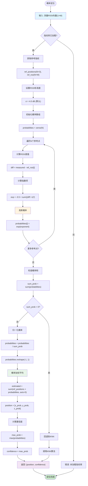

# 室内定位系统算法流程图

本文档包含室内定位系统的各个核心算法流程图，使用Mermaid语法绘制。

---

## 1. 系统总体架构流程图



---

## 2. 3D模型加载与单位转换流程



---

## 3. 射线追踪电磁仿真流程



---

## 4. 批量向量化射线追踪流程

```mermaid
graph TB
    Start([批量射线追踪]) --> Input["输入: AP数组(M×3), 接收点数组(N×3)"]

    Input --> InitArrays[初始化空数组]
    InitArrays --> Arrays["ray_origins[], ray_directions[], ray_pairs[]"]

    Arrays --> LoopRx[遍历N个接收点]
    LoopRx --> LoopTx[遍历M个AP]

    LoopTx --> CalcPair["计算: 距离、方向"]
    CalcPair --> Append["添加到数组"]
    Append --> CheckMore{更多AP?}

    CheckMore -->|是| LoopTx
    CheckMore -->|否| CheckMoreRx{更多接收点?}

    CheckMoreRx -->|是| LoopRx
    CheckMoreRx -->|否| Convert[转换为NumPy数组]

    Convert --> TotalRays["总射线数 = N × M"]
    TotalRays --> LogCount[记录射线数量]

    LogCount --> BatchCall[单次调用trimesh]
    BatchCall --> BatchAPI["mesh.ray.intersects_location(全部射线)"]

    BatchAPI --> GetResults[获取所有交点]
    GetResults --> InitBlocked[初始化遮挡标记数组]
    InitBlocked --> BlockedArray["is_blocked = zeros(N×M)"]

    BlockedArray --> LoopHits[遍历每个交点]
    LoopHits --> CheckHitDist[检查交点距离]
    CheckHitDist --> MarkBlocked{交点在AP之前?}

    MarkBlocked -->|是| SetTrue["is_blocked[i] = True"]
    MarkBlocked -->|否| KeepFalse[保持False]

    SetTrue --> NextHit{更多交点?}
    KeepFalse --> NextHit
    NextHit -->|是| LoopHits
    NextHit -->|否| InitMatrix[初始化RSSI矩阵]

    InitMatrix --> RSSIMatrix["rssi_matrix = zeros(N, M)"]
    RSSIMatrix --> LoopPairs[遍历所有射线对]

    LoopPairs --> GetRefl{检查is_blocked[i]}
    GetRefl -->|True| Refl1[反射次数 = 1]
    GetRefl -->|False| Refl0[反射次数 = 0]

    Refl1 --> CalcRSSI[计算RSSI]
    Refl0 --> CalcRSSI
    CalcRSSI --> AddShadow[添加阴影衰落]
    AddShadow --> FillMatrix["rssi_matrix[rx_idx, tx_idx] = RSSI"]

    FillMatrix --> NextPair{更多射线对?}
    NextPair -->|是| LoopPairs
    NextPair -->|否| Return["返回: rssi_matrix(N×M)"]

    Return --> End([批量计算完成])

    style Input fill:#e1f5ff
    style BatchCall fill:#fff4e1
    style InitMatrix fill:#e8f5e9
    style Return fill:#f3e5f5
    style End fill:#c8e6c9
```

---

## 5. 指纹库构建流程

```mermaid
graph TB
    Start([开始构建指纹库]) --> CheckModel{模型已加载?}

    CheckModel -->|否| Error1[错误: 请先加载模型]
    CheckModel -->|是| GetConfig[读取配置参数]

    GetConfig --> Params["网格间距、高度、AP位置等"]
    Params --> Mode{2D或3D模式?}

    Mode -->|2D| Gen2D[生成2D网格]
    Mode -->|3D| Gen3D[生成3D网格]

    Gen2D --> Grid2D["XY平面网格 + 固定高度Z"]
    Gen3D --> Grid3D["XYZ立体网格 + Z层间距"]

    Grid2D --> CountPoints
    Grid3D --> CountPoints[计算采样点总数]

    CountPoints --> HPMode{启用高精度模式?}

    HPMode -->|是| ConfigHP[配置高精度参数]
    HPMode -->|否| UseBasic[使用基础配置]

    ConfigHP --> SetReflections[设置最大反射次数]
    SetReflections --> SetMaterial[设置默认材料]
    SetMaterial --> CheckPreset{使用场景预设?}

    CheckPreset -->|是| LoadPreset[加载预设材料配置]
    CheckPreset -->|否| BasicMaterial[使用基本材料]

    LoadPreset --> CreateTracer[创建高精度射线追踪器]
    BasicMaterial --> CreateTracer
    UseBasic --> CreateBasicTracer[创建基础射线追踪器]

    CreateTracer --> PrepareAP
    CreateBasicTracer --> PrepareAP[准备AP位置数组]

    PrepareAP --> APArray["ap_positions = array(M×3)"]
    APArray --> CalcBatch[计算批次大小]

    CalcBatch --> BatchLogic{采样点数量}
    BatchLogic -->|≤100| Batch1[batch_size = 全部]
    BatchLogic -->|100-1000| Batch2[batch_size = 50]
    BatchLogic -->|1000-10000| Batch3[batch_size = 100]
    BatchLogic -->|>10000| Batch4[batch_size = 200]

    Batch1 --> InitDB[初始化指纹数据库]
    Batch2 --> InitDB
    Batch3 --> InitDB
    Batch4 --> InitDB

    InitDB --> LoopBatch[遍历批次]
    LoopBatch --> GetBatch[获取当前批次点]
    GetBatch --> BatchTrace[批量射线追踪]

    BatchTrace --> RSSIBatch["rssi_batch = simulate_signal_batch()"]
    RSSIBatch --> LoopPoints[遍历批次中的点]

    LoopPoints --> AddFP[添加指纹]
    AddFP --> FPData["database.add_fingerprint(pos, rssi)"]
    FPData --> UpdateProgress[更新进度条]
    UpdateProgress --> Callback["progress_callback(current, total, %)"]

    Callback --> NextPoint{更多点?}
    NextPoint -->|是| LoopPoints
    NextPoint -->|否| NextBatch{更多批次?}

    NextBatch -->|是| LoopBatch
    NextBatch -->|否| SaveDB[保存指纹库]

    SaveDB --> Timestamp[生成时间戳]
    Timestamp --> SavePath["fingerprint_YYYYMMDD_HHMMSS.pkl"]
    SavePath --> Pickle[pickle序列化]
    Pickle --> WriteFile[写入文件]

    WriteFile --> Visualize{需要可视化?}
    Visualize -->|是| GenHeatmap[生成热图]
    Visualize -->|否| End([构建完成])

    GenHeatmap --> Plotly[使用Plotly绘制]
    Plotly --> SaveHTML[保存为HTML]
    SaveHTML --> End

    Error1 --> End

    style CheckModel fill:#e1f5ff
    style BatchTrace fill:#fff4e1
    style SaveDB fill:#e8f5e9
    style End fill:#c8e6c9
```



---

## 6. K近邻(KNN)定位算法流程



---

## 7. 加权K近邻(WKNN)定位算法流程



---

## 8. 概率定位算法流程



---

## 9. 非合作定位跟踪流程

```mermaid
graph TB
    Start([启动非合作定位]) --> InitCollector[初始化信号采集器]

    InitCollector --> Mode{采集器模式}
    Mode -->|模拟| SimCollector[UniversalEMSignalCollector]
    Mode -->|真实| RealCollector[RealEMSignalCollector]

    SimCollector --> LoadFP[加载指纹库]
    RealCollector --> ConnectAP[连接真实AP]

    LoadFP --> InitTracker
    ConnectAP --> InitTracker[初始化设备跟踪器]

    InitTracker --> SetParams[设置跟踪参数]
    SetParams --> Params["update_interval, device_timeout"]
    Params --> StartLoop[启动跟踪循环]

    StartLoop --> CheckActive{tracking_active?}
    CheckActive -->|否| StopTrack[停止跟踪]
    CheckActive -->|是| ScanTargets[扫描信号源]

    ScanTargets --> Discover{自动发现?}
    Discover -->|是| AutoScan[自动扫描全频段]
    Discover -->|否| ManualList[使用手动列表]

    AutoScan --> DeviceList
    ManualList --> DeviceList[获取设备列表]

    DeviceList --> CheckEmpty{有设备?}
    CheckEmpty -->|否| Sleep1[等待更新间隔]
    CheckEmpty -->|是| LoopDevices[遍历设备]

    LoopDevices --> GetDevice[获取设备信息]
    GetDevice --> DeviceInfo["device_id, signal_type"]
    DeviceInfo --> CollectRSSI[采集RSSI]

    CollectRSSI --> SignalType{信号类型}
    SignalType -->|WiFi| CollectWiFi[WiFi RSSI]
    SignalType -->|蓝牙| CollectBT[蓝牙 RSSI]
    SignalType -->|手机| CollectCell[手机信号 RSSI]
    SignalType -->|RFID| CollectRFID[RFID RSSI]
    SignalType -->|其他| CollectOther[其他信号 RSSI]

    CollectWiFi --> RSSIVector
    CollectBT --> RSSIVector
    CollectCell --> RSSIVector
    CollectRFID --> RSSIVector
    CollectOther --> RSSIVector["rssi_vector = [rssi₁, rssi₂, ..., rssiₘ]"]

    RSSIVector --> CheckValid{RSSI有效?}
    CheckValid -->|否| NextDevice1
    CheckValid -->|是| Localize[调用定位引擎]

    Localize --> EngineCall["result = localization_engine.locate(rssi)"]
    EngineCall --> GetResult[获取结果]
    GetResult --> ResultData["position, confidence"]

    ResultData --> CheckConf{confidence > 阈值?}
    CheckConf -->|否| LowConf[记录低置信度]
    CheckConf -->|是| UpdateDevice[更新设备状态]

    UpdateDevice --> DeviceState["devices[id].update(position, time)"]
    DeviceState --> LogPosition[记录位置历史]
    LogPosition --> CheckAlarm{触发报警?}

    CheckAlarm -->|禁区| Alarm1[发送禁区报警]
    CheckAlarm -->|异常移动| Alarm2[发送异常报警]
    CheckAlarm -->|正常| NoAlarm[继续]

    Alarm1 --> NextDevice1
    Alarm2 --> NextDevice1
    NoAlarm --> NextDevice1
    LowConf --> NextDevice1{更多设备?}

    NextDevice1 -->|是| LoopDevices
    NextDevice1 -->|否| CleanTimeout[清理超时设备]

    CleanTimeout --> CheckTime["current_time - last_seen > timeout"]
    CheckTime --> RemoveDevice[移除超时设备]
    RemoveDevice --> Sleep2[等待更新间隔]
    Sleep1 --> CheckActive
    Sleep2 --> CheckActive

    StopTrack --> SaveLog[保存跟踪日志]
    SaveLog --> End([跟踪结束])

    style InitCollector fill:#e1f5ff
    style CollectRSSI fill:#fff4e1
    style Localize fill:#e8f5e9
    style UpdateDevice fill:#f3e5f5
    style End fill:#c8e6c9
```



---

## 10. 高精度反射模式流程

```mermaid
graph TB
    Start([高精度反射模式]) --> Enable{启用高精度?}

    Enable -->|否| BasicMode[使用简化模式]
    Enable -->|是| ConfigHP[配置高精度参数]

    ConfigHP --> SetMaxRefl[设置最大反射次数]
    SetMaxRefl --> MaxRefl["max_reflections = 2-4"]
    MaxRefl --> SetMaterial[设置默认材料]
    SetMaterial --> DefMat["default_material = concrete/brick/..."]

    DefMat --> CheckPreset{使用预设配置?}
    CheckPreset -->|否| BasicConfig[基本材料配置]
    CheckPreset -->|是| LoadPreset[加载场景预设]

    LoadPreset --> PresetType{预设类型}
    PresetType -->|办公室| Office["反射2次, 石膏板"]
    PresetType -->|地下室| Basement["反射4次, 混凝土"]
    PresetType -->|仓库| Warehouse["反射3次, 金属货架"]
    PresetType -->|住宅| Residential["反射2次, 砖墙"]

    Office --> Materials
    Basement --> Materials
    Warehouse --> Materials
    Residential --> Materials
    BasicConfig --> Materials[材料属性配置]

    Materials --> MatProps["reflection_coefficient, absorption_db"]
    MatProps --> CreateTracer[创建高精度追踪器]
    BasicMode --> CreateBasic[创建基础追踪器]

    CreateTracer --> TraceStart[开始射线追踪]
    CreateBasic --> TraceStart

    TraceStart --> InitRay[初始化射线]
    InitRay --> RayData["origin, direction, power"]
    RayData --> BounceCount["bounce_count = 0"]
    BounceCount --> TraceLoop{bounce < max_reflections?}

    TraceLoop -->|否| CalcTotal[计算总损耗]
    TraceLoop -->|是| Intersect[射线求交]

    Intersect --> TrimeshCall["locations, normals = intersect()"]
    TrimeshCall --> CheckHit{有交点?}

    CheckHit -->|否| CalcTotal
    CheckHit -->|是| GetHitInfo[获取交点信息]

    GetHitInfo --> HitData["hit_point, hit_normal, hit_face"]
    HitData --> GetMaterial[查询材料属性]
    GetMaterial --> FaceMat["material = face_materials[hit_face]"]
    FaceMat --> GetProps[获取材料系数]
    GetProps --> Props["refl_coef, absorb_db"]

    Props --> CalcReflPower[计算反射功率]
    CalcReflPower --> ReflPower["power *= refl_coef"]
    ReflPower --> AddAbsorb["loss += absorb_db"]
    AddAbsorb --> CalcReflDir[计算反射方向]

    CalcReflDir --> Fresnel["使用Fresnel公式"]
    Fresnel --> NewDir["reflected_dir = reflect(incident, normal)"]
    NewDir --> UpdateRay[更新射线]
    UpdateRay --> NewRay["origin = hit_point, direction = reflected_dir"]

    NewRay --> IncBounce["bounce_count += 1"]
    IncBounce --> CheckPower{power > threshold?}
    CheckPower -->|否| CalcTotal
    CheckPower -->|是| TraceLoop

    CalcTotal --> TotalLoss["total_loss = 基础损耗 + 反射损耗 + 吸收损耗"]
    TotalLoss --> FinalRSSI["RSSI = Ptx - total_loss"]
    FinalRSSI --> AddNoise[添加阴影衰落]
    AddNoise --> Return[返回精确RSSI]
    Return --> End([高精度追踪完成])

    style ConfigHP fill:#e1f5ff
    style LoadPreset fill:#fff4e1
    style Intersect fill:#ffe0e0
    style CalcReflDir fill:#e8f5e9
    style Return fill:#f3e5f5
    style End fill:#c8e6c9
```



---

## 使用说明

这些流程图使用Mermaid语法编写，可以在支持Mermaid的Markdown查看器中渲染：

1. **GitHub**: 自动渲染Mermaid图表
2. **VS Code**: 安装 "Markdown Preview Mermaid Support" 插件
3. **在线工具**: https://mermaid.live/
4. **Typora**: 内置Mermaid支持
5. **GitBook/Notion**: 支持Mermaid代码块

### 颜色说明
- 🔵 浅蓝色 (#e1f5ff): 输入/初始化步骤
- 🟡 浅黄色 (#fff4e1): 核心计算步骤
- 🟢 浅绿色 (#e8f5e9): 数据处理/存储步骤
- 🟣 浅紫色 (#f3e5f5): 输出/结果步骤
- 🔴 浅红色 (#ffe0e0): 关键决策步骤
- 🟢 深绿色 (#c8e6c9): 完成状态

---

**文档版本**: 1.0
**创建日期**: 2025-10-15
**作者**: Claude Code Assistant
